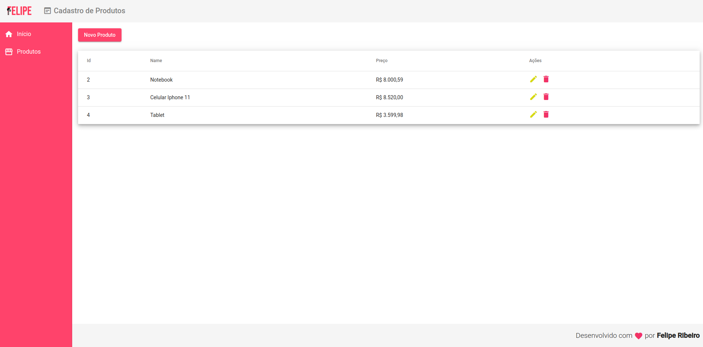

# Cadastro de Produtos
> Aplicação em Angular.

<p align="center">
  <a href="https://opensource.org/licenses/MIT">
    
  </a>
</p>

Aplicação de cadastro de produtos.



# Tecnologias

## Front-end

* HTML
* CSS
* TypeScript
* Angular

## Back-end

* json-service

## Instalação


```sh
npm i
```


<!-- Markdown link & img dfn's -->
[npm-image]: https://img.shields.io/npm/v/datadog-metrics.svg?style=flat-square
[npm-url]: https://npmjs.org/package/datadog-metrics
[npm-downloads]: https://img.shields.io/npm/dm/datadog-metrics.svg?style=flat-square
[travis-image]: https://img.shields.io/travis/dbader/node-datadog-metrics/master.svg?style=flat-square
[travis-url]: https://travis-ci.org/dbader/node-datadog-metrics
[wiki]: https://github.com/yourname/yourproject/wiki


## Further help

To get more help on the Angular CLI use `ng help` or go check out the [Angular CLI README](https://github.com/angular/angular-cli/blob/master/README.md).

